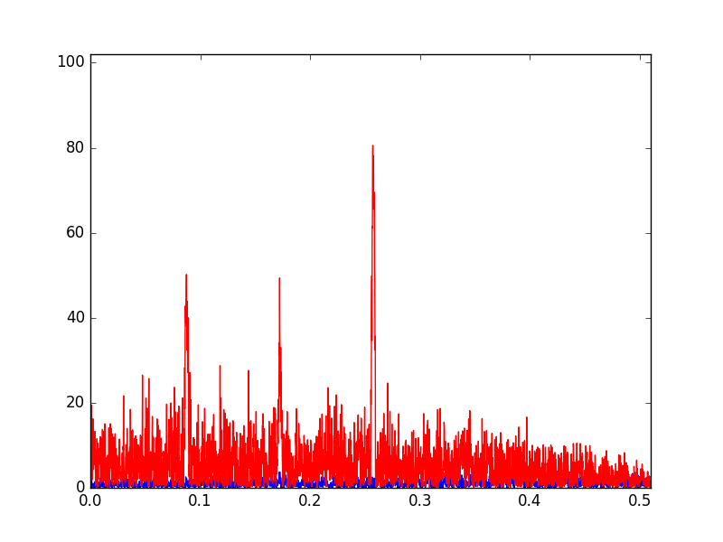

Peak Sidelobe (PSL) Level of Binary Sequences Research Kit
==========================================================

PslRK - set of references and programs related with Peak Sidelobe Level of binary sequences:
- [Related with topic references](References) - set of links and documents which contain
    proofs, results of research, confirmations of approaches and other related information;
- [Low PSL code detectors](Solutions) - set of solutions of the problem of finding binary
    sequences with low PSL level;
- [Projects results (achievements)](Reports) - list of known binary sequences with low PSL
    level;
- [Tools](Tools) - set of related tools.

Project aims
============
Topical aims of the project are:
- collect sequences with low PSL level which are already known;
- find sequences with low PSL level which aren't already known.

Contributing
============
There are several ways to contibute this project.
- improve existing or add new source code;
- enlarge existing references base;
- enlarge existing sequences base;
- open new issues.
