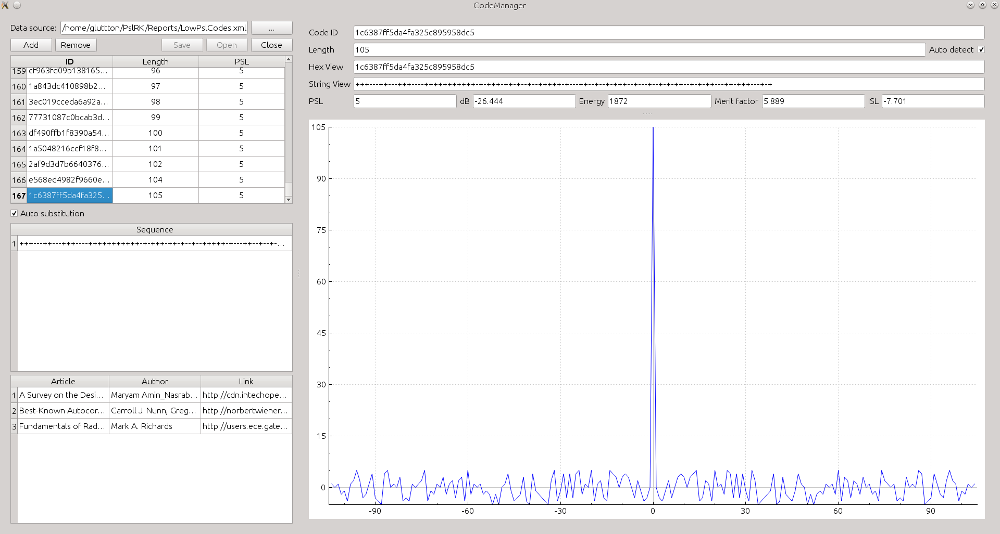

CodeManager
===========
Tool for everyday tasks.


System requirements
===================
CMake is required in the first place, other requirements will be suggested by CMake.
Following tools are required for building the project:
- cmake;
- g++;
- pugi-xml;
- qt.


Features
========
The CodeManager already has CLI (deprecated) and GUI (Qt) user interface which allows:
- convert hex view of sequence into string view (based on symbols '+' and '-') and vice versa;
- calculate Peak Sidelobe Level (PSL) of sequence;
- get view of sequence which is required for adding to the [Collection](https://github.com/Gluttton/PslRK/tree/master/Reports);
- calculate [Autocorrelation Function (ACF)](http://en.wikipedia.org/wiki/Autocorrelation);
- calculate [Cross-correlation Function (ACF)](http://en.wikipedia.org/wiki/Cross-correlation) with user defined sequence;
- manipulate whith the Collection of sequences.


Usage GUI
=========
Using of GUI is trivial. Example of session see below:



Usage CLI
=========
CLI version of the CodeManager is deprecated and not recommended but still available. It less comfortable than GUI version and not contains some features.
Example of session which consists of the following steps:
- open the Collection of sequences;
- input sequence in arbitrary view;
- convert view of sequnce which is required;
- calculate and print PSL;
- add sequence in the Collection;
- save and close the Collection.

```
> open base base.xml
> push code 038FE23225492
> show codes
038FE23225492
> to string 50
> show codes
----+++---+++++++---+---++--+---+--+-+-+--+--+--+-
> show psl
4
> show id
----+++---+++++++---+---++--+---+--+-+-+--+--+--+- - 3c701dcddab6d
> add base
Input code: > 3c701dcddab6d
Sequence: ++++---+++-------+++-+++--++-+++-++-+-+-++-++-++-+
ID:       3c701dcddab6d
Length:   50
PSL:      4
Input reference article: > Binary Sequences with Minimum Peak Sidelobe Level up to Length 68
Input reference author: > Leukhin A.N., Potehin E.N.
Input reference link: > http://arxiv.org/pdf/1212.4930.pdf
> save base
> close base
> quit
```
