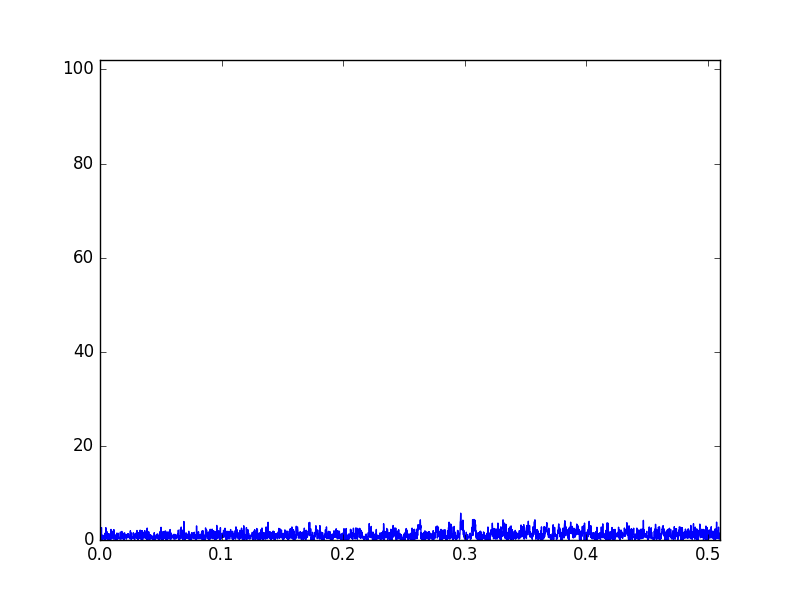
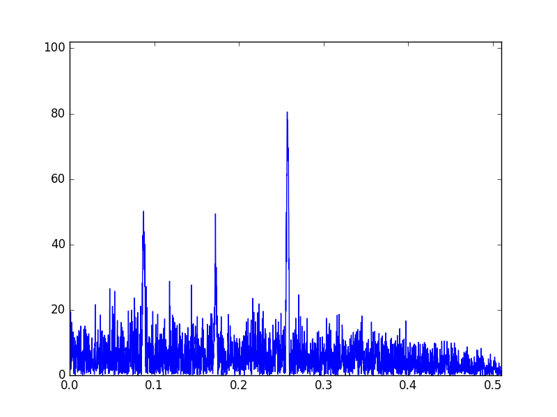

Modeling
========
Set of Python scripts for modeling BPSK signal.

System requirements
===================
To launch scripts are required Python 3 with following packages:  
- scipy;  
- numpy;  
- matplotlib.  
To launch notebook the Jupyter is also required.

Features
========
Scripts are contain examples of usage the sequences with low PSL in real world.
Among other there is example which shows how to three noisy and overlapped signals:

can be found using compression:

